# LuckyIsland

> Windows 灵动岛式桌面助手 · 常驻屏幕顶部，一眼看清时间、天气、待办、行情，顺手敲木鱼、查历史、问 AI。

LuckyIsland 把 macOS 灵动岛的形态搬到了 Windows：一个常驻屏幕顶部中央的透明小条，平时只占一行高度显示时钟；鼠标悬停或热键展开成一块「单页画布」，在时间 / 日历 / 天气 / 股票 / 待办 / 终端 / 通知之间秒切。还能通过本地 HTTP 端点接收 Claude / Codex 的完成通知，用 Windows toast 弹给你。


## 它能做什么

**灵动岛外壳**
- 三态窗口：隐藏 / 紧凑（720×80 单行）/ 展开（720×400 画布），260ms 缓动过渡
- 透明窗 + 毛玻璃，跟随系统深浅色
- 多屏选择 + 位置持久化：副屏断开自动回退主屏；重连后由应用主动移回原副屏的行为已确定，待模块 11 实现
- 托盘菜单、开机自启、单实例

**时间页（可自定义组件）**
- 流式画布：上下满行 + 左右窄列 + 中央时钟，组件开关 / 区域 / 拖拽排序
- 内置五个组件：一言、程序员历史上的今天、今日运势、电子木鱼（带疯狂星期四彩蛋）、今日心情（五档 + 连续天数）
- 时钟可自定义位置（上方 / 中央 / 下方）、纯色或双色渐变、9 个主题预设、12/24 小时制、字号字重

**其他页面**
- **日历**：月视图 + 农历 / 节气 / 节日
- **天气**：uapis.cn 多城市 + IP 自动定位 + 离线缓存 + 气象预警
- **股票**：腾讯实时行情 + sina 搜索 + 日 / 周 / 月 K 线 + 拖拽排序
- **待办**：CRUD + 优先级 / 截止 + SQLite 持久化
- **终端**：xterm.js + portable-pty 多 tab + 快捷命令 + 一键打开 Windows Terminal
- **通知**：本地 HTTP 端点 + token 鉴权 + SQLite 历史 + Windows toast

**AI 助手**
- 独立面板，三选一 Provider：Claude CLI / Codex CLI / 自定义 Chat API
- 联网搜索、流式问答、请求可取消、对话历史
- `Alt+Space` 随时唤起

**语音**
- sherpa-onnx 唤醒词 + 流式 ASR + Windows SAPI5 TTS 应答
- 唤醒时懒加载模型，闲置 ~110MB

**设置**
- 独立设置窗口：总体 / 外观 / 页面管理 / 通知 / 终端 / 天气 / 股票 / AI / 语音 / 时间组件 / 时间外观
- 配置导入导出（安全白名单，密钥 / token / 缓存 / 运行数据不外泄）
- 窗口透明度、双轴偏移实时预览

## 快捷键

| 操作 | 快捷键 |
|---|---|
| 显示 / 隐藏灵动岛 | `Alt+X` |
| 唤起 AI 助手 | `Alt+Space` |
| 切换页面 | `Alt+1~9` / `Alt+←` / `Alt+->` / 滚轮 |
| 托盘左键 | 显示 / 隐藏 |

## 技术栈

- **Tauri 2**（Rust 后端 + WebView2 渲染，安装包 ~12.5MB，含 sherpa-onnx 动态库）
- **React 19** + TypeScript + Vite
- **Tailwind CSS v4** + shadcn 风格 UI + motion 12 动画
- **rusqlite** 本地存储、**reqwest** 网络层、**chrono / nongli** 农历
- **xterm.js + portable-pty** 终端、**sherpa-onnx + cpal** 语音
- 测试：Vitest（纯逻辑）+ Rust `#[cfg(test)]`

## 性能

- 语音关闭基线 ~61MB，CPU < 1%
- 语音开启闲置 ~110MB（唤醒时懒加载 ASR）
- 安装包 ~12.5MB（thin LTO + strip；sherpa-onnx 走 shared 动态链接，4 个 DLL 随包打包）

## 开发

```bash
pnpm install
pnpm tauri dev       # 桌面应用开发（需 Rust + MSVC 工具链）
pnpm tauri build     # 打包 NSIS 安装包
pnpm typecheck       # TypeScript 类型检查
pnpm test:frontend   # Vitest：Node 纯逻辑 + happy-dom React 生命周期
pnpm build:frontend  # 构建 index/settings/ai 三个 HTML 入口
pnpm fmt:rust        # 检查 Rust 格式，不改写文件
pnpm clippy:rust     # 全 targets Clippy，warnings 视为失败
pnpm test:rust       # Rust lib 单元测试
pnpm check:rust      # Rust 编译检查
pnpm verify          # 串行执行上述自动化验证门禁
pnpm check:native-runtime # 打包前检查 4 个原生 DLL 的映射源
```

`pnpm test` 保留为 `pnpm test:frontend` 的兼容别名，不代表全项目测试。`pnpm verify` 也不替代 Windows GUI、安装包、DLL、外部 Provider 或长时间真机验收。

### 开发环境与打包前置

- 仓库声明 pnpm 10、Node 22 LTS 和 Rust 1.92 stable-msvc；Corepack 可读取 `packageManager`，Rustup 可读取 `rust-toolchain.toml`。
- 仓库不固定 npm registry。用 `pnpm config get registry` 检查当前用户/CI 配置；若仍指向已停用的 `registry.npm.taobao.org` 并出现证书错误，应先修复环境配置，不能把依赖下载失败误报为源码测试失败。
- sherpa-onnx 1.13.4 使用 shared 模式。未设置本地来源时，其 build script 从 k2-fsa GitHub Release 获取 Windows x64 shared archive；离线/受控环境可使用 `SHERPA_ONNX_LIB_DIR` 或 `SHERPA_ONNX_ARCHIVE_DIR`。
- build script 会将运行时 DLL 复制到 Cargo profile 目录，Tauri 再从默认 `src-tauri/target/release` 映射四个 DLL。正式 `pnpm tauri build` 不应设置独立 `CARGO_TARGET_DIR`；独立 target 只用于 check/test/clippy，避免与 `tauri dev` 争锁。
- 默认 release build 完成后，先运行 `pnpm check:native-runtime`。它只验证 Tauri 资源映射及四个非空源文件，不证明 NSIS 内部清单或安装后 DLL 可加载；安装态仍需单独验收。

> Rust 工具链：本仓库当前验证基线为 Rust 1.92.0 `x86_64-pc-windows-msvc`。本机可将 rustup/cargo 放在自定义目录；路径位置不是仓库契约。

## 通知接入

LuckyIsland 在 `127.0.0.1:9753/notify` 暴露一个本地 HTTP 端点（Bearer 或 `?token=` 鉴权），任何脚本 / hook 都能往里发通知：

```bash
curl -X POST http://127.0.0.1:9753/notify \
  -H "Authorization: Bearer <token>" \
  -H "Content-Type: application/json" \
  -d '{"title":"构建完成","body":"lucky-island 发布成功","source":"ci"}'
```

仓库自带 `lucky-notify` CLI 和 Claude Code / Codex 的 hook 配置示例，详见 [docs/Claude-Codex-hook配置.md](docs/Claude-Codex-hook配置.md)。
## 界面画廊

### 灵动岛状态

<p align="center">
  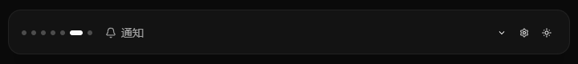
  <br />
  <sub>紧凑状态</sub>
</p>

<p align="center">
  
  <br />
  <sub>紧凑状态 · 另一主题</sub>
</p>


### 主题预览

<p align="center">
  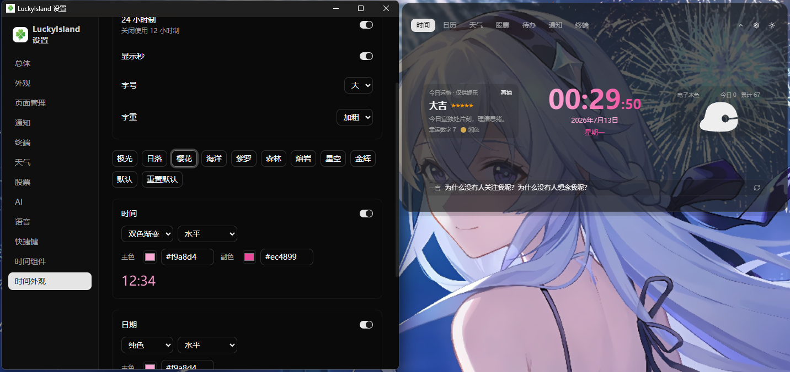
  <br /><sub>主题预览 · 一</sub>
</p>

<p align="center">
  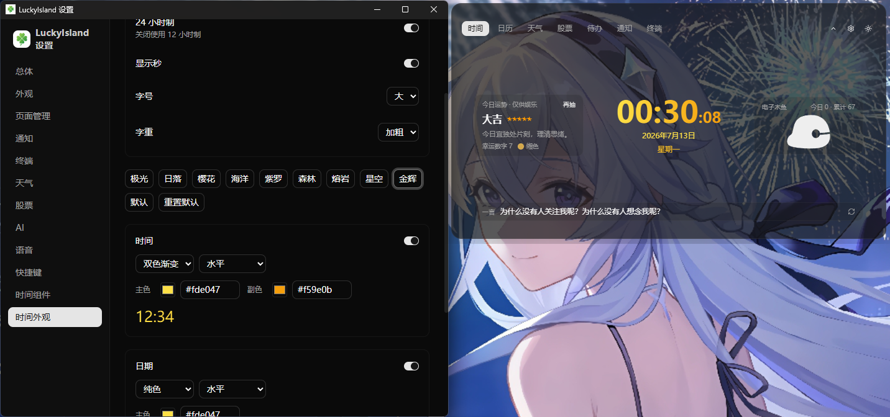
  <br /><sub>主题预览 · 二</sub>
</p>

<p align="center">
  
  <br /><sub>主题预览 · 三</sub>
</p>

### 展开界面与功能页面

<table>
  <tr>
    <td align="center" width="50%">
      
      <br /><sub>展开界面</sub>
    </td>
    <td align="center" width="50%">
      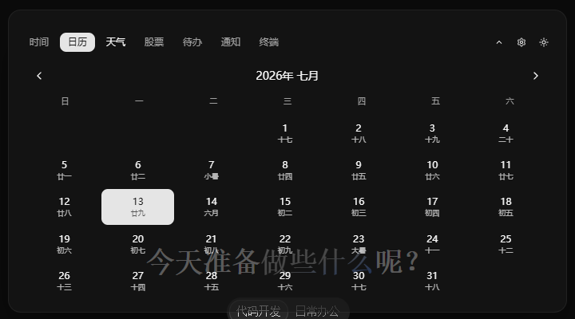
      <br /><sub>展开界面 · 主题二</sub>
    </td>
  </tr>
  <tr>
    <td align="center" width="50%">
      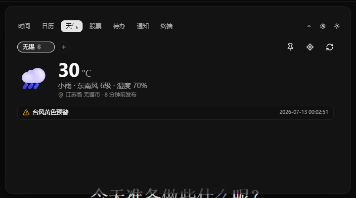
      <br /><sub>展开界面 · 主题三</sub>
    </td>
    <td align="center" width="50%">
      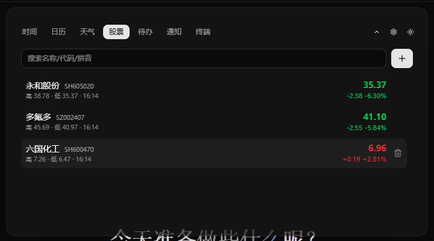
      <br /><sub>展开界面 · 主题四</sub>
    </td>
  </tr>
  <tr>
    <td align="center" width="50%">
      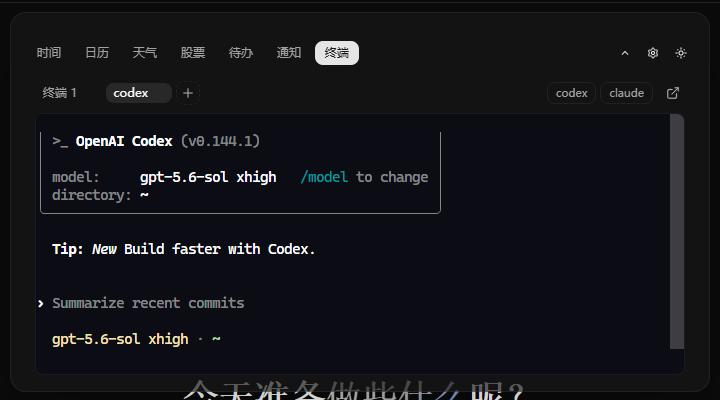
      <br /><sub>展开界面 · 主题五</sub>
    </td>
    <td align="center" width="50%">
      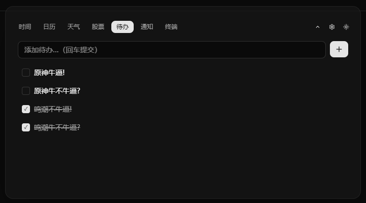
      <br /><sub>待办页面</sub>
    </td>
  </tr>
  <tr>
    <td align="center" width="50%">
      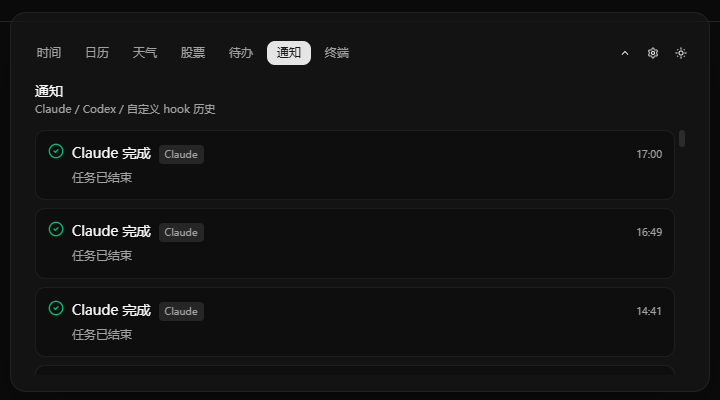
      <br /><sub>通知页面</sub>
    </td>
    <td align="center" width="50%">
      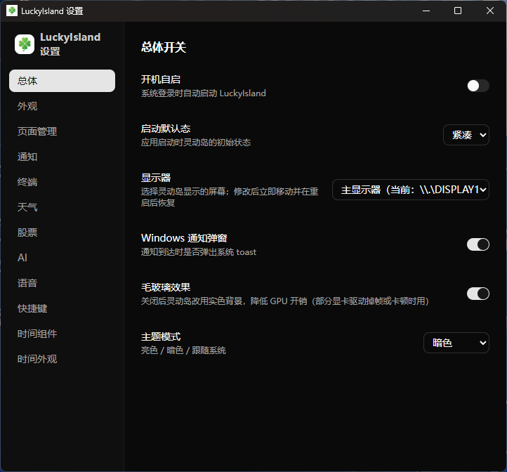
      <br /><sub>设置窗口</sub>
    </td>
  </tr>
  <tr>
    <td align="center" colspan="2">
      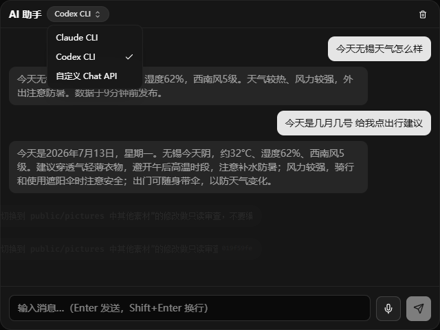
      <br /><sub>AI 助手页面</sub>
    </td>
  </tr>
</table>

## 项目结构

```
src/                      前端（React）
  components/pages/       各页面（time/calendar/weather/stock/todo/terminal/notify）
  settings/               设置面板各子面板
  lib/                    settings KV、动画、拖拽等工具
src-tauri/src/            Rust 后端
  data/                   天气 / 股票 / 日历 / 待办 / time_api（一言/历史）
  ai/                     AI 路由 / provider / 历史
  voice/                  唤醒 / ASR / TTS
  storage/                SQLite + 配置导入导出白名单
  monitor.rs              多屏选择与窗口定位
docs/                     需求 / 技术栈 / 开发进度 / hook 配置
vault/                    模块任务拆解
```

## 文档

- [需求文档](docs/需求文档.md)
- [技术栈规划](docs/技术栈规划.md)
- [开发进度](docs/开发进度.md)
- [Claude/Codex hook 配置](docs/Claude-Codex-hook配置.md)
- [稳定版本发布与签名维护](docs/releasing.md)
- [时间页组件设计](docs/superpowers/specs/2026-07-11-time-page-widgets-design.md)

## 许可证

[MIT License](LICENSE)。代码、文档与仓库内素材均按 MIT 授权，可自由使用、修改、分发（含商用），需保留版权声明

## 友链

[LINUX DO](https://linux.do/)